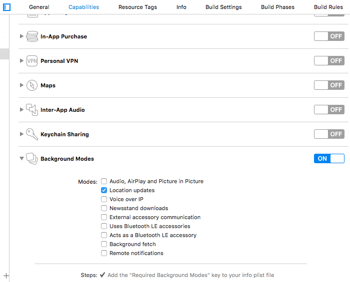

# INSTALLATION

### 1 / Preparation

* Get your APP_ID and APP_KEY from app.bealder.com

### 2 / Capabilities

You have to enable Background Mode :

* Location updates



### 3 / Add framework

* Drag and drop bealder framework in the project
* Go into Project configuration and Drag framework from files list to the Embeded Benaries. It should appear in the Linked Framework too.


### 4 / Update Info.plist

* NSLocationAlwaysUsageDescription : Your text for location permission (replace Bealder in screenshoot)
* App Transport Security Settings > Allow Arbitrary Loads > YES : This allow your app to accès content from the Notification


### 5 / Code to add in AppDelegate.m

```shell
- (BOOL)application:(UIApplication *)application didFinishLaunchingWithOptions:(NSDictionary *)launchOptions {

    BealderSDK * sdk = [BealderSDK sharedManager];
    [sdk setAppId: @"{BEALDER_APP_ID}"];
    [sdk setAppKey: @"{BEALDER_APP_KEY}"];
    [sdk setAppRegion: @"{BEACON_REGION}"];
    [sdk setOptions:launchOptions];
    [sdk start];

    return YES;
}

- (void)application:(UIApplication *)application didReceiveLocalNotification:(UILocalNotification *)notification {

    [UIApplication sharedApplication].applicationIconBadgeNumber--;
    [[BealderSDK sharedManager] openPopup:[notification.userInfo objectForKey:@"url"]];

}
```
### 6 / Complete installation movie

[](http://www.youtube.com/watch?v=tX6eISAAUi4)
